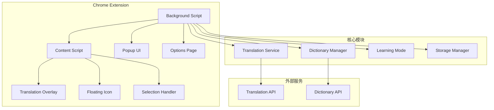

# 设计文档

## 概述

Chrome翻译插件是一个基于Manifest V3的浏览器扩展，提供智能网页翻译、选词翻译和学习模式功能。插件采用模块化架构，支持多种翻译服务，并提供丰富的学习功能来帮助用户提升语言能力。

## 架构

### 整体架构



### 技术栈

- **前端框架**: Vanilla JavaScript + CSS3
- **构建工具**: Webpack 5
- **UI库**: 自定义轻量级组件
- **存储**: Chrome Storage API
- **翻译服务**: Google Translate API / Microsoft Translator API
- **词典服务**: 内置词库 + 在线词典API

## 组件和接口

### 1. Background Script (后台脚本)

负责插件的核心逻辑和服务协调。

```typescript
interface BackgroundService {
  // 翻译服务管理
  translateText(text: string, targetLang: string): Promise<TranslationResult>;
  
  // 存储管理
  saveUserData(data: UserData): Promise<void>;
  loadUserData(): Promise<UserData>;
  
  // 词库管理
  loadDictionary(type: DictionaryType): Promise<Dictionary>;
  
  // 学习模式管理
  addToVocabulary(word: VocabularyItem): Promise<void>;
  getVocabularyStats(): Promise<VocabularyStats>;
}
```

### 2. Content Script (内容脚本)

在网页中注入翻译功能。

```typescript
interface ContentScript {
  // 页面翻译
  translatePage(): Promise<void>;
  restoreOriginalPage(): void;
  
  // 选词翻译
  handleTextSelection(selection: Selection): void;
  showTranslationTooltip(text: string, position: Position): void;
  
  // 浮动图标
  createFloatingIcon(): HTMLElement;
  updateIconState(state: IconState): void;
  
  // 学习模式
  highlightVocabulary(words: string[]): void;
  markWordAsLearned(word: string): void;
}
```

### 3. Translation Service (翻译服务)

统一的翻译接口，支持多个翻译提供商。

```typescript
interface TranslationService {
  // 文本翻译
  translate(request: TranslationRequest): Promise<TranslationResult>;
  
  // 语言检测
  detectLanguage(text: string): Promise<string>;
  
  // 批量翻译
  batchTranslate(texts: string[], targetLang: string): Promise<TranslationResult[]>;
}

interface TranslationRequest {
  text: string;
  sourceLang?: string;
  targetLang: string;
  context?: string;
}

interface TranslationResult {
  originalText: string;
  translatedText: string;
  sourceLang: string;
  targetLang: string;
  confidence: number;
  alternatives?: string[];
}
```

### 4. Dictionary Manager (词典管理器)

管理内置词库和用户词汇。

```typescript
interface DictionaryManager {
  // 词库加载
  loadBuiltInDictionary(type: DictionaryType): Promise<Dictionary>;
  
  // 词汇查询
  lookupWord(word: string): Promise<WordDefinition>;
  
  // 词库管理
  getDictionaryList(): DictionaryInfo[];
  setActiveDictionary(type: DictionaryType): void;
  
  // 学习进度
  updateLearningProgress(word: string, progress: LearningProgress): void;
  getLearningStats(dictionaryType: DictionaryType): Promise<LearningStats>;
}

interface Dictionary {
  type: DictionaryType;
  name: string;
  words: WordDefinition[];
  totalCount: number;
}

interface WordDefinition {
  word: string;
  pronunciation: string;
  partOfSpeech: string;
  definitions: string[];
  examples: string[];
  difficulty: number;
  frequency: number;
}
```

### 5. Learning Mode (学习模式)

管理用户的学习进度和词汇收集。

```typescript
interface LearningMode {
  // 生词管理
  addVocabulary(item: VocabularyItem): Promise<void>;
  removeVocabulary(word: string): Promise<void>;
  getVocabularyList(): Promise<VocabularyItem[]>;
  
  // 学习进度
  markAsLearned(word: string): Promise<void>;
  updateReviewSchedule(word: string): Promise<void>;
  
  // 复习系统
  getWordsForReview(): Promise<VocabularyItem[]>;
  scheduleNextReview(word: string, performance: ReviewPerformance): Promise<void>;
  
  // 统计信息
  getLearningStats(): Promise<LearningStats>;
}

interface VocabularyItem {
  word: string;
  translation: string;
  context: string;
  sourceUrl: string;
  addedDate: Date;
  reviewCount: number;
  masteryLevel: number;
  nextReviewDate: Date;
}
```

## 数据模型

### 用户数据结构

```typescript
interface UserData {
  settings: UserSettings;
  vocabulary: VocabularyItem[];
  learningStats: LearningStats;
  dictionaryProgress: Record<DictionaryType, DictionaryProgress>;
}

interface UserSettings {
  defaultTargetLanguage: string;
  translationProvider: TranslationProvider;
  floatingIconPosition: Position;
  learningModeEnabled: boolean;
  activeDictionaries: DictionaryType[];
  highlightColors: HighlightColors;
}

interface LearningStats {
  totalWordsLearned: number;
  dailyGoal: number;
  currentStreak: number;
  longestStreak: number;
  reviewAccuracy: number;
  timeSpentLearning: number;
}
```

### 翻译缓存结构

```typescript
interface TranslationCache {
  key: string; // 原文的hash值
  originalText: string;
  translatedText: string;
  sourceLang: string;
  targetLang: string;
  timestamp: number;
  expiryTime: number;
}
```

## 错误处理

### 错误类型定义

```typescript
enum ErrorType {
  TRANSLATION_API_ERROR = 'translation_api_error',
  NETWORK_ERROR = 'network_error',
  STORAGE_ERROR = 'storage_error',
  DICTIONARY_LOAD_ERROR = 'dictionary_load_error',
  CONTENT_SCRIPT_ERROR = 'content_script_error'
}

interface ExtensionError {
  type: ErrorType;
  message: string;
  details?: any;
  timestamp: Date;
  url?: string;
}
```

### 错误处理策略

1. **翻译API错误**
   - 自动重试机制（最多3次）
   - 降级到备用翻译服务
   - 显示用户友好的错误信息

2. **网络错误**
   - 检测网络连接状态
   - 提供离线模式（使用缓存）
   - 网络恢复后自动重试

3. **存储错误**
   - 数据备份和恢复机制
   - 存储空间不足时的清理策略
   - 数据同步冲突解决

4. **内容脚本错误**
   - 页面兼容性检测
   - 优雅降级处理
   - 错误上报和分析

## 正确性属性

*属性是一个特征或行为，应该在系统的所有有效执行中保持为真——本质上是关于系统应该做什么的正式声明。属性作为人类可读规范和机器可验证正确性保证之间的桥梁。*

基于需求分析，以下是Chrome翻译插件的核心正确性属性：

### 属性 1：页面翻译往返一致性
*对于任何*网页内容，执行翻译然后恢复原文应该返回到完全相同的原始状态
**验证需求：需求 1.4**

### 属性 2：翻译内容完整性
*对于任何*包含文本的网页，翻译后的页面应该包含所有原始文本的对应译文，且保持原有的页面结构
**验证需求：需求 1.1, 1.2, 1.3**

### 属性 3：动态内容自动翻译
*对于任何*在翻译模式下新增的页面内容，系统应该自动检测并翻译新增的文本内容
**验证需求：需求 1.5**

### 属性 4：选词翻译响应性
*对于任何*用户选中的文本，系统应该显示包含翻译结果的工具提示，且点击外部区域后工具提示消失
**验证需求：需求 3.1, 3.2, 3.3**

### 属性 5：词汇信息完整性
*对于任何*选中的单词或句子，翻译结果应该包含相应的详细信息（单词包含词性、音标等，句子包含完整翻译）
**验证需求：需求 3.4, 3.5**

### 属性 6：数据存储往返一致性
*对于任何*用户添加的生词或调整的设置，保存后重新加载应该得到完全相同的数据
**验证需求：需求 4.1, 4.2, 5.1, 5.2, 5.3**

### 属性 7：学习模式词汇高亮
*对于任何*启用学习模式的页面，所有属于当前选定词库的词汇都应该被正确高亮显示
**验证需求：需求 4.3, 4.7**

### 属性 8：词库管理功能完整性
*对于任何*选定的词库，系统应该正确加载词汇列表，高亮页面中的对应词汇，并在点击时显示详细信息
**验证需求：需求 8.2, 8.3, 8.4**

### 属性 9：学习进度准确性
*对于任何*学习活动，系统记录的进度数据应该准确反映用户的学习状态和统计信息
**验证需求：需求 8.5, 8.6**

### 属性 10：翻译API调用可靠性
*对于任何*翻译请求，系统应该正确调用翻译API并处理响应，包括错误情况的处理和重试机制
**验证需求：需求 6.1, 6.3**

### 属性 11：语言检测准确性
*对于任何*输入文本，系统应该能够检测语言并选择合适的翻译方向
**验证需求：需求 6.4**

### 属性 12：UI交互响应性
*对于任何*用户界面交互（拖拽图标、点击按钮等），系统应该提供相应的视觉反馈和状态更新
**验证需求：需求 2.3, 2.4, 2.5**

### 属性 13：数据导出完整性
*对于任何*用户数据导出操作，导出的数据应该包含所有用户的设置、生词和学习进度信息
**验证需求：需求 5.4**

### 属性 14：跨设备数据同步一致性
*对于任何*登录Chrome账户的用户，在不同设备间的数据应该保持同步和一致
**验证需求：需求 5.5**

### 属性 15：工具提示位置智能性
*对于任何*工具提示显示，系统应该计算合适的位置确保不遮挡重要内容
**验证需求：需求 7.3**

## 测试策略

## 测试策略

### 双重测试方法

我们将采用单元测试和基于属性的测试相结合的方法：

- **单元测试**：验证具体示例、边缘情况和错误条件
- **属性测试**：验证所有输入的通用属性
- **集成测试**：验证组件间的交互和端到端流程

### 基于属性的测试配置

**测试框架选择**：
- 使用 **fast-check** 库进行JavaScript/TypeScript的属性测试
- 每个属性测试运行最少100次迭代
- 每个正确性属性必须由单个属性测试实现

**测试标记格式**：
每个属性测试必须使用以下注释格式标记：
```javascript
// Feature: chrome-translation-extension, Property 1: 页面翻译往返一致性
```

**测试覆盖范围**：
- 属性测试处理大量随机输入的综合覆盖
- 单元测试专注于具体示例和集成点
- 避免编写过多单元测试，属性测试已覆盖大量输入场景

### 单元测试重点

单元测试应专注于：
- 具体的翻译示例和预期结果
- 组件间的集成点
- 边缘情况和错误条件处理
- API调用的模拟和响应处理

### 集成测试

使用Puppeteer进行端到端测试：
- 完整的翻译流程测试
- 用户界面交互测试
- 多页面场景测试
- 性能和内存使用测试

### 兼容性测试

- 不同Chrome版本的兼容性
- 各种网站的页面适配
- 不同语言对的翻译质量
- 移动设备上的触摸交互